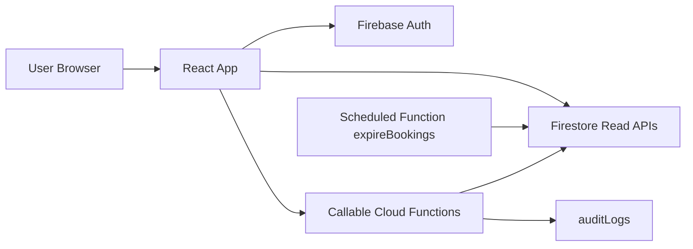

# System Architecture

## Overview

Enderase is a role-based smart parking platform built on modern web technologies. This document explains the technical foundation of the application.

### Technology Stack Explained

| Technology | Purpose | Why We Use It |
|------------|---------|---------------|
| **React (Create React App)** | Frontend framework | Component-based UI development with a large ecosystem |
| **React Router** | Navigation | Handles page routing and URL management |
| **Tailwind CSS / shadcn-ui** | Styling | Utility-first CSS with pre-built accessible components |
| **Sonner** | Toast notifications | Lightweight, customizable notification system |
| **TanStack React Query** | Server state management | Caching, background updates, and optimistic UI |
| **Firebase Cloud Functions** | Backend logic | Serverless functions for business operations |
| **Firestore** | Database | NoSQL database with real-time capabilities |
| **Firebase Auth** | Authentication | Secure user login with email/password |
| **Google Maps JavaScript API** | Maps | Display parking locations on an interactive map |

---

## High-Level Design

The diagram below shows how data flows through the system:



### What This Means

1. **User Browser** - The user accesses the app through their web browser
2. **React App** - The frontend application running in the browser
3. **Firebase Auth** - Handles user login and session management
4. **Firestore** - The database that stores all application data
5. **Cloud Functions** - Server-side code that handles business logic (creating bookings, processing payments, etc.)
6. **Scheduled Functions** - Automated tasks that run periodically (like expiring old reservations)
7. **Audit Logs** - Records of important actions for accountability

---

## Why This Architecture?

### Key Design Principles

| Principle | Implementation | Benefit |
|-----------|----------------|---------|
| **Server-side writes** | Business-critical operations happen in Cloud Functions | Prevents data corruption and ensures consistency |
| **Client write protection** | Firestore rules block direct client writes for protected collections | Security through defense in depth |
| **Role-based access** | Both frontend and backend enforce user roles | Users can only access appropriate features |
| **Emulator-first development** | Local development uses Firebase emulators | Fast iteration without affecting production |

### Why Firebase?

Firebase was chosen because it provides:

- **Authentication** - Built-in user management
- **Firestore** - Real-time database with offline support
- **Cloud Functions** - Serverless backend without managing servers
- **Hosting** - Easy deployment of the web app
- **Emulators** - Local development environment that mirrors production

---

## Active Frontend Modules

### Core Application Files

| File | Purpose |
|------|---------|
| `src/App.js` | Main application component with routing |
| `src/app/RoleGuards.js` | Components that protect routes based on user roles |
| `src/app/roleUtils.js` | Helper functions for role checking |

### Authentication Pages

| File | Purpose |
|------|---------|
| `src/pages/Login.js` | User login form |
| `src/pages/signup.js` | New user registration (creates driver accounts) |

### Role Home Pages

Each user type has a dedicated home page:

| File | User Type | Description |
|------|-----------|-------------|
| `src/pages/DriverHome.js` | Driver | View bookings, active sessions, submit payments |
| `src/pages/OperatorHome.js` | Operator | Check-in vehicles, confirm payments, generate QR codes |
| `src/pages/OwnerHome.js` | Owner | View parking analytics, manage operators |
| `src/pages/AdminHome.js` | Admin | Platform-wide analytics, manage owners and parkings |

### Special Pages

| File | Purpose |
|------|---------|
| `src/pages/DriverCheckInConfirm.js` | Page drivers see when scanning a QR code |

---

## Active Backend Module

| File | Purpose |
|------|---------|
| `functions/index.js` | All Cloud Functions (callable and scheduled) |

---

## Core Platform Concepts

Understanding these terms is essential for working with the codebase:

| Concept | Definition | Example |
|---------|------------|---------|
| **Parking** | A managed parking location with multiple slots | "Bole Mall Parking" with 50 slots |
| **Booking** | A reservation made before arriving at the parking | Driver reserves a spot for 2:00 PM |
| **Session** | The active period when a vehicle is parked | From check-in at 2:00 PM to checkout at 4:00 PM |
| **Payment Request** | A driver-submitted payment awaiting operator approval | Driver sends bank transfer reference |
| **Payment** | A settled (completed) transaction | Operator confirms payment, session ends |
| **Check-In Token** | A QR code generated by an operator for driver check-in | Valid for 5 minutes, one-time use |
| **Check-In Request** | A pending request created when a driver scans a QR code | Awaits operator approval |

### Entity Lifecycle

```
Booking (reserved) → Check-In → Session (active) → Payment Request → Payment → Session (completed)
```

