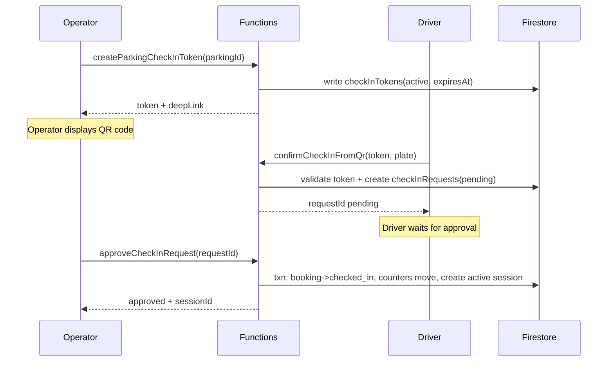

# QR Check-In Flow

This document explains how the QR code check-in process works in the Enderase Smart Parking platform.

## What Is QR Check-In?

QR check-in is a fast, contactless way for drivers to check in their vehicles at parking locations. Instead of the operator manually typing the plate number, the driver scans a QR code displayed by the operator.

### Why Use QR Check-In?

| Benefit | Explanation |
|---------|-------------|
| **Speed** | Faster than manual plate entry |
| **Accuracy** | No typos in plate numbers |
| **Control** | Operator still approves each check-in |
| **Security** | Tokens expire quickly, preventing reuse |

---

## The Big Picture

### Who Does What?

| Role | Action |
|------|--------|
| **Operator** | Generates QR code, displays it to driver, approves check-in |
| **Driver** | Scans QR code, enters plate number, waits for approval |
| **System** | Creates tokens, validates requests, manages state |

### The Flow in Simple Terms

1. Operator generates a QR code in their app
2. Driver scans the QR code with their phone
3. Driver enters their plate number and submits
4. Operator sees the request and approves it
5. Vehicle is checked in and parking session starts

---

## End-to-End Flow Diagram



---

## Step-by-Step Walkthrough

### Step 1: Operator Generates QR Code

**What happens:**
1. Operator opens their app and selects "Generate QR"
2. App calls `createParkingCheckInToken(parkingId)`
3. Cloud Function creates a token document:

```javascript
// checkInTokens/{tokenId}
{
  parkingId: "parking123",
  operatorUid: "operator123",
  expiresAt: timestamp,  // 5 minutes from now
  status: "active"
}
```

4. Function returns a deep link URL
5. App displays the URL as a QR code

**What the operator sees:**
- A QR code on their screen
- An expiration countdown (5 minutes)
- A list of pending check-in requests

---

### Step 2: Driver Scans QR Code

**What happens:**
1. Driver opens their phone's camera or the app
2. Driver scans the QR code
3. Phone opens the deep link: `https://app.example.com/checkin?token=abc123`
4. App navigates to the check-in confirmation page

**What the driver sees:**
- A form asking for their plate number
- Which parking they're checking into
- A submit button

---

### Step 3: Driver Submits Check-In Request

**What happens:**
1. Driver enters plate number: `AA-1234-B`
2. Driver taps "Submit"
3. App calls `confirmCheckInFromQr(token, plateNumber)`
4. Cloud Function validates:
   - Token exists
   - Token status is `active`
   - Token hasn't expired
5. Function marks token as `used`
6. Function creates a check-in request:

```javascript
// checkInRequests/{requestId}
{
  parkingId: "parking123",
  driverUid: "driver456",
  plateNumber: "AA-1234-B",
  tokenId: "abc123",
  bookingId: "booking789",  // If driver has a booking
  ownerId: "owner123",
  status: "pending",
  requestedAt: timestamp
}
```

**What the driver sees:**
- "Request submitted, waiting for operator approval"
- A loading/pending state

---

### Step 4: Operator Reviews Request

**What happens:**
1. Operator's app receives the new request via Firestore real-time listener
2. Request appears in the operator's pending queue

**What the operator sees:**
- Driver's plate number
- Whether driver has a booking
- "Approve" and "Reject" buttons

---

### Step 5: Operator Approves Check-In

**What happens:**
1. Operator taps "Approve"
2. App calls `approveCheckInRequest(requestId)`
3. Cloud Function runs a transaction:

**If driver has a booking:**
```javascript
// Update booking
bookings/{bookingId}: { status: "checked_in", checkInAt: now }

// Update parking counters
parkings/{parkingId}: {
  reservedSlots: reservedSlots - 1,
  occupiedSlots: occupiedSlots + 1
}
```

**If driver has no booking (walk-in):**
```javascript
// Update parking counters
parkings/{parkingId}: {
  availableSlots: availableSlots - 1,
  occupiedSlots: occupiedSlots + 1
}
```

**Create session:**
```javascript
// sessions/{sessionId}
{
  parkingId: "parking123",
  bookingId: "booking789",  // or null
  driverId: "driver456",
  plateNumber: "AA-1234-B",
  entryTime: now,
  status: "active",
  paymentStatus: "unpaid",
  checkedInBy: "operator123"
}
```

**Update request:**
```javascript
checkInRequests/{requestId}: {
  status: "approved",
  reviewedAt: now,
  reviewedBy: "operator123"
}
```

**What the driver sees:**
- "Check-in approved!"
- Their active session details
- Option to submit payment when ready

**What the operator sees:**
- Request removed from pending queue
- New active session in their session list

---

## States and Statuses

### Token States

| Status | Meaning | Can Be Used? |
|--------|---------|--------------|
| `active` | Token is valid and waiting to be scanned | Yes |
| `used` | Token was used for a check-in | No |
| `expired` | Token timed out without being used | No |

### Request States

| Status | Meaning | Next Action |
|--------|---------|-------------|
| `pending` | Waiting for operator review | Operator approves or rejects |
| `approved` | Operator approved, session started | None (complete) |
| `rejected` | Operator rejected | Driver must get new QR and retry |
| `expired` | Request timed out without review | Driver must get new QR and retry |

---

## Frontend Implementation

### Operator Side

**File:** `src/pages/OperatorHome.js`

**Features:**
- Button to generate QR code
- QR code display with countdown timer
- Real-time list of pending check-in requests
- Approve/Reject buttons for each request

**Key Code Patterns:**
```javascript
// Generate QR token
const generateQR = async () => {
  const result = await createParkingCheckInToken({ parkingId });
  setQrToken(result.token);
  setQrDeepLink(result.deepLink);
  setQrExpiresAt(result.expiresAt);
};

// Listen for pending requests
useEffect(() => {
  const unsubscribe = onSnapshot(
    query(checkInRequestsRef, where('status', '==', 'pending')),
    (snapshot) => {
      setPendingRequests(snapshot.docs.map(doc => ({ id: doc.id, ...doc.data() })));
    }
  );
  return unsubscribe;
}, []);
```

---

### Driver Side

**File:** `src/pages/DriverCheckInConfirm.js`

**Features:**
- Receives token from URL parameter
- Shows parking name and location
- Form for plate number entry
- Submit button with loading state
- Success/error feedback

**Key Code Patterns:**
```javascript
// Get token from URL
const { token } = useParams();  // or useSearchParams

// Submit check-in request
const handleSubmit = async () => {
  setLoading(true);
  try {
    const result = await confirmCheckInFromQr({ token, plateNumber });
    setStatus('pending');
    setRequestId(result.requestId);
  } catch (error) {
    setError(error.message);
  } finally {
    setLoading(false);
  }
};
```

---

## Failure Cases and Handling

### Token Expired

**When:** Driver scans QR after 5 minutes have passed

**What happens:**
1. Function checks `expiresAt < now`
2. Function throws error: "Token expired"
3. Driver sees: "This QR code has expired. Please ask the operator for a new one."

**Solution:** Operator generates a new QR code

---

### Token Already Used

**When:** Driver tries to scan the same QR code twice

**What happens:**
1. Function checks `status !== "active"`
2. Function throws error: "Token already used"
3. Driver sees: "This QR code has already been used."

**Solution:** Operator generates a new QR code

---

### Operator Not Assigned

**When:** Operator tries to generate QR for parking they're not assigned to

**What happens:**
1. Function checks operator's `assignedParkingIds`
2. Function throws error: "Permission denied"
3. Operator sees: "You are not assigned to this parking."

**Solution:** Owner must assign operator to the parking

---

### Driver Not Logged In

**When:** Someone scans QR without being logged in

**What happens:**
1. App detects no authenticated user
2. App redirects to login page
3. After login, driver can try again

**Solution:** Driver must log in first

---

## Security Considerations

### Token Security

| Measure | Purpose |
|---------|---------|
| Short expiration (5 min) | Prevents reuse of old QR codes |
| One-time use | Token marked `used` after first scan |
| Parking-specific | Token only works for one parking |
| Operator tracking | System knows who generated each token |

### Request Security

| Measure | Purpose |
|---------|---------|
| Operator approval required | Driver can't self-check-in |
| Assignment validation | Only assigned operators can approve |
| Audit logging | All actions recorded for accountability |

---

## Comparison: QR vs Manual Check-In

| Aspect | QR Check-In | Manual Check-In |
|--------|-------------|-----------------|
| Speed | Faster (driver enters own info) | Slower (operator types) |
| Accuracy | No typos | Possible typos |
| Driver involvement | Required (must scan) | Optional |
| Operator involvement | Still required (must approve) | Required |
| Best for | Busy periods, tech-savvy drivers | Walk-ins, quick entries |

---

## Related Documentation

- `docs/06-cloud-functions-api.md` - Function reference for QR functions
- `docs/05-firestore-data-model.md` - Token and request data structures
- `docs/08-manual-payment-flow.md` - What happens after check-in