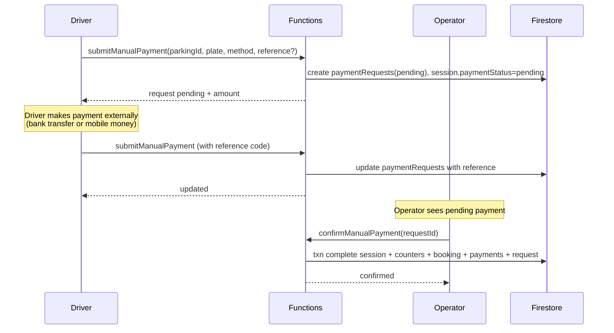

# Manual Payment Flow

This document explains how payments work in the Enderase Smart Parking platform.

## Overview

The Enderase platform uses a **face-to-face confirmation model** for payments. This means:

- Drivers submit payment proof through the app
- Operators review and confirm the payment in person
- Sessions only complete after operator confirmation

### Why Manual Confirmation?

| Benefit | Explanation |
|---------|-------------|
| **Fraud prevention** | Operator verifies payment before allowing exit |
| **Flexibility** | Supports bank transfer and mobile money |
| **Local context** | Works well in markets where digital payments are still evolving |
| **Accountability** | Every payment is tied to a specific operator |

---

## The Core Rule

> A session is **NOT completed** when the driver clicks checkout.  
> It completes **ONLY** after the operator confirms payment.

This is different from many parking apps where payment is automatic. In Enderase, the operator is the gatekeeper.

---

## Billing Rule

The platform uses a simple flat-rate billing model:

| Rule | Formula |
|------|---------|
| **Rate** | 50 ETB per started hour |
| **Calculation** | `ceil(durationMinutes / 60) × 50` |

### Examples

| Duration | Billed Hours | Fee |
|----------|--------------|-----|
| 30 minutes | 1 hour | 50 ETB |
| 1 hour 15 minutes | 2 hours | 100 ETB |
| 2 hours 30 minutes | 3 hours | 150 ETB |
| 5 minutes | 1 hour | 50 ETB |

**Note:** Every started hour counts as a full hour. There's no prorating for partial hours.

---

## End-to-End Flow Diagram



---

## Step-by-Step Walkthrough

### Step 1: Driver Views Active Session

**What happens:**
1. Driver opens the app
2. Driver sees their active session card
3. Card shows:
   - Parking name
   - Entry time
   - Current duration
   - Estimated fee (updates in real-time)

**What the driver sees:**
```
┌─────────────────────────────────┐
│ 🚗 Active Session               │
│                                 │
│ Bole Mall Parking               │
│ Entry: 2:00 PM                  │
│ Duration: 1h 30m                │
│ Est. Fee: 100 ETB               │
│                                 │
│ [Submit Payment]                │
└─────────────────────────────────┘
```

---

### Step 2: Driver Opens Payment Modal

**What happens:**
1. Driver taps "Submit Payment"
2. Modal opens showing:
   - Amount due (calculated at that moment)
   - Payment destination (owner's bank account or phone)
   - Payment method selection
   - Reference code input

**What the driver sees:**
```
┌─────────────────────────────────┐
│ 💰 Submit Payment               │
│                                 │
│ Amount Due: 100 ETB             │
│                                 │
│ Pay to:                         │
│ Bank: 123456789                 │
│ Phone: +251912345678            │
│                                 │
│ Method: [Bank] [Phone]          │
│                                 │
│ Reference Code: [________]      │
│                                 │
│ [Submit] [Cancel]               │
└─────────────────────────────────┘
```

---

### Step 3: Driver Makes External Payment

**What happens:**
1. Driver uses their banking app or mobile money
2. Driver transfers the amount to the owner's account
3. Driver receives a transaction reference/confirmation number
4. Driver enters this reference in the app

**Payment Methods:**

| Method | How It Works |
|--------|--------------|
| **Bank Transfer** | Driver transfers to owner's bank account, enters transaction ID |
| **Mobile Money** | Driver sends to owner's phone number, enters confirmation code |

---

### Step 4: Driver Submits Payment Request

**What happens:**
1. Driver enters reference code (optional but recommended)
2. Driver taps "Submit"
3. App calls `submitManualPayment()` Cloud Function
4. Function:
   - Calculates final fee
   - Creates `paymentRequests` document
   - Updates session `paymentStatus: "pending"`

**Created Document:**
```javascript
// paymentRequests/{requestId}
{
  sessionId: "session123",
  parkingId: "parking123",
  driverId: "driver456",
  plateNumber: "AA-1234-B",
  amountDue: 100,
  billedHours: 2,
  hourlyRate: 50,
  method: "bank",
  referenceCode: "TXN123456",
  status: "pending",
  submittedAt: timestamp
}
```

**Updated Session:**
```javascript
// sessions/{sessionId}
{
  // ... existing fields
  paymentStatus: "pending"  // Changed from "unpaid"
}
```

**What the driver sees:**
- "Payment submitted, waiting for operator confirmation"
- A pending status indicator
- Their request details

---

### Step 5: Operator Reviews Payment

**What happens:**
1. Operator's app receives the payment request via real-time listener
2. Request appears in the "Pending Payments" queue

**What the operator sees:**
```
┌─────────────────────────────────┐
│ 📋 Pending Payments             │
│                                 │
│ ┌─────────────────────────────┐ │
│ │ AA-1234-B                   │ │
│ │ Amount: 100 ETB             │ │
│ │ Method: Bank                │ │
│ │ Ref: TXN123456              │ │
│ │ [Confirm] [Reject]          │ │
│ └─────────────────────────────┘ │
└─────────────────────────────────┘
```

---

### Step 6: Operator Confirms Payment

**What happens:**
1. Operator verifies the payment externally:
   - Checks their bank statement for the transaction
   - Or checks mobile money history
2. Operator taps "Confirm"
3. App calls `confirmManualPayment(requestId)`
4. Cloud Function runs a transaction that updates multiple documents

**Transaction Updates:**

| Document | Changes |
|----------|---------|
| `paymentRequests/{requestId}` | `status: "confirmed"`, `reviewedAt: now`, `reviewedBy: operatorId` |
| `sessions/{sessionId}` | `status: "completed"`, `paymentStatus: "confirmed"`, `exitTime: now`, `durationMinutes`, `billedHours`, `feeAmount` |
| `parkings/{parkingId}` | `occupiedSlots--`, `availableSlots++` |
| `bookings/{bookingId}` | `status: "completed"` (if linked) |
| `payments/{paymentId}` | New document with commission split |

**Created Payment Document:**
```javascript
// payments/{paymentId}
{
  sessionId: "session123",
  bookingId: "booking789",
  parkingId: "parking123",
  driverId: "driver456",
  ownerId: "owner123",
  grossAmount: 100,
  ownerAmount: 90,           // 90%
  platformCommission: 10,    // 10%
  paidAt: timestamp
}
```

**What the driver sees:**
- "Payment confirmed! Thank you for using Enderase."
- Session marked as completed
- Receipt with payment details

**What the operator sees:**
- Request removed from pending queue
- Session marked as completed
- Updated parking slot count

---

## Alternative: Operator Rejects Payment

**When this happens:**
- Reference code doesn't match any transaction
- Wrong amount was sent
- Payment went to wrong account

**What happens:**
1. Operator taps "Reject"
2. Operator enters rejection reason (optional)
3. App calls `rejectManualPayment(requestId)`
4. Function updates `paymentRequests/{requestId}`:
   - `status: "rejected"`
   - `rejectionReason: "Invalid reference"`
   - `reviewedAt: now`
   - `reviewedBy: operatorId`

**What the driver sees:**
- "Payment rejected: Invalid reference"
- Session remains active
- Option to submit a new payment with correct details

---

## Data Writes During Confirm

The `confirmManualPayment` function is the most complex transaction in the system. Here's exactly what it updates:

### 1. Payment Request

```javascript
paymentRequests/{requestId}: {
  status: "confirmed",
  reviewedAt: serverTimestamp(),
  reviewedBy: "operator123"
}
```

### 2. Session

```javascript
sessions/{sessionId}: {
  status: "completed",
  paymentStatus: "confirmed",
  exitTime: serverTimestamp(),
  durationMinutes: 90,        // Calculated
  billedHours: 2,             // ceil(90/60)
  feeAmount: 100              // 2 * 50
}
```

### 3. Parking Counters

```javascript
parkings/{parkingId}: {
  occupiedSlots: occupiedSlots - 1,
  availableSlots: availableSlots + 1
}
```

### 4. Booking (if linked)

```javascript
bookings/{bookingId}: {
  status: "completed",
  checkOutAt: serverTimestamp()
}
```

### 5. Payment Record

```javascript
payments/{paymentId}: {
  sessionId: "session123",
  bookingId: "booking789",
  parkingId: "parking123",
  driverId: "driver456",
  ownerId: "owner123",
  grossAmount: 100,
  ownerAmount: 90,
  platformCommission: 10,
  paidAt: serverTimestamp()
}
```

---

## Frontend Implementation

### Driver Side

**File:** `src/pages/DriverHome.js`

**Key Features:**
- Active session card with real-time duration
- Payment modal with owner's payment details
- Method selection (bank/phone)
- Reference code input
- Pending state handling
- Duplicate submission prevention

**Key Code Patterns:**
```javascript
// Get owner's payment details for display
const { data: paymentDetails } = useQuery({
  queryKey: ['paymentDetails', parkingId],
  queryFn: () => getParkingPaymentDetails({ parkingId })
});

// Submit payment
const submitPayment = async () => {
  if (pendingRequest) {
    // Already have a pending request, don't submit again
    return;
  }
  
  await submitManualPayment({
    parkingId,
    plateNumber,
    method,
    referenceCode
  });
};
```

---

### Operator Side

**File:** `src/pages/OperatorHome.js`

**Key Features:**
- Real-time pending payments list
- Each request shows: plate, amount, method, reference
- Confirm and Reject buttons
- Success/error feedback

**Key Code Patterns:**
```javascript
// Listen for pending payment requests
useEffect(() => {
  const q = query(
    collection(db, 'paymentRequests'),
    where('parkingId', '==', parkingId),
    where('status', '==', 'pending')
  );
  
  const unsubscribe = onSnapshot(q, (snapshot) => {
    setPendingPayments(snapshot.docs.map(doc => ({ id: doc.id, ...doc.data() })));
  });
  
  return unsubscribe;
}, [parkingId]);

// Confirm payment
const handleConfirm = async (requestId) => {
  await confirmManualPayment({ requestId });
  // UI updates automatically via Firestore listener
};

// Reject payment
const handleReject = async (requestId, reason) => {
  await rejectManualPayment({ requestId, reason });
};
```

---

## Commission Calculation

The platform takes a 10% commission on all payments:

```
platformCommission = grossAmount × 0.10
ownerAmount = grossAmount - platformCommission
```

### Example Breakdown

| Gross Amount | Platform (10%) | Owner (90%) |
|--------------|----------------|-------------|
| 50 ETB | 5 ETB | 45 ETB |
| 100 ETB | 10 ETB | 90 ETB |
| 150 ETB | 15 ETB | 135 ETB |
| 200 ETB | 20 ETB | 180 ETB |

---

## Common Scenarios

### Scenario 1: Normal Payment Flow

1. Driver parks at 2:00 PM
2. Driver leaves at 3:30 PM
3. Driver submits payment with reference
4. Operator confirms
5. Session ends, payment recorded

### Scenario 2: Payment Rejected

1. Driver submits payment
2. Operator can't find the transaction
3. Operator rejects with reason
4. Driver checks their bank app
5. Driver resubmits with correct reference
6. Operator confirms

### Scenario 3: Multiple Pending Payments

1. Driver submits payment
2. Driver accidentally submits again
3. Second submission is blocked (pending request exists)
4. Driver waits for operator to confirm first request

---

## Security Considerations

| Risk | Mitigation |
|------|------------|
| Fake reference codes | Operator verifies externally before confirming |
| Double payment | System blocks duplicate submissions |
| Payment to wrong account | App shows correct destination from owner profile |
| Session manipulation | All updates happen in server-side transaction |

---

## Related Documentation

- `docs/06-cloud-functions-api.md` - Payment function reference
- `docs/05-firestore-data-model.md` - Payment data structures
- `docs/10-analytics-and-commission.md` - How payments appear in analytics